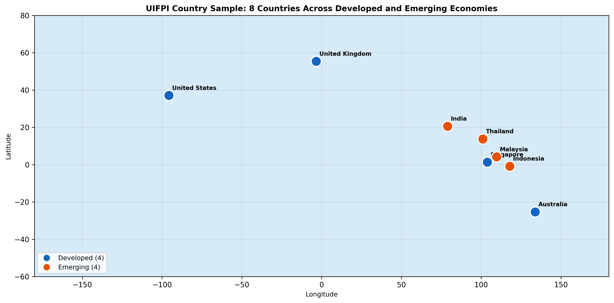
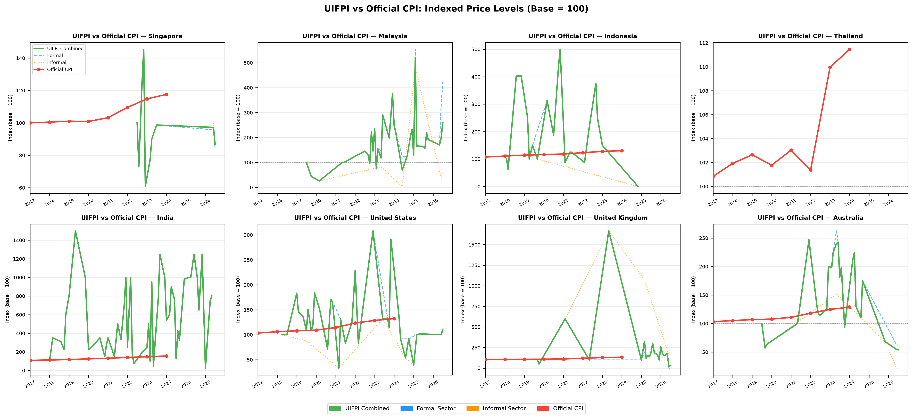
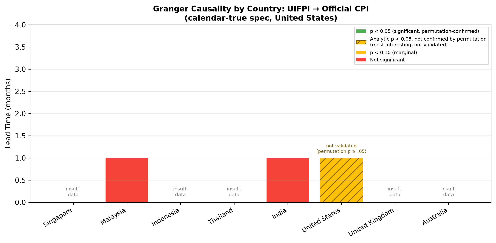

# UICPI — A Method for Collecting Chain and Independent Restaurant Prices at Scale, with Evidence from the United States

**Author**: Wen Chen Er
**Affiliation**: Raffles Institution, Singapore
**Category**: Behavioral & Social Sciences / Economics
**Status**: IRC-SET Submission Draft (2026-07-12) — calendar-true respec applied.

---

## 1. Abstract

Consumer price indices in developing economies rely on infrequent collection, and algorithmic alternatives like the MIT Billion Prices Project exclude services and the informal food economy (40–65 % of food expenditure in emerging markets). This paper's contribution is a **scalable, publicly available method** for collecting restaurant-chain and independent-vendor menu prices and constructing a Unified Independent-Chain Price Index (UICPI), with an eight-country panel as proof of concept.

The pipeline combines Phase 0 yield probes against Wayback CDX archives to triage sources, per-source extractors matched to each platform's HTML pattern, a live forward-collection scraper, and a bail-decision audit trail. Index construction uses the matched-model restaurant-median method; Granger testing follows Cavallo and Rigobon (2016).

Applied to 48,730 price observations (2026-06-19 snapshot) across the eight-country panel, the method's most numerically interesting result — not a validated finding — comes from one country: in the United States (n = 31), UICPI Granger-leads headline CPI at an exact one-month calendar lag (F(1, 28) = 4.20, analytic p = 0.0499; permutation p = 0.052 shuffle / 0.069 block), strengthening under a forward-fill robustness check (F(1, 35) = 9.05, p = 0.0048, n = 38). India (n = 47) and Malaysia (n = 30) both return clean nulls (F = 0.521, p = 0.474; F = 0.111, p = 0.742). Five countries remain below n = 24, accumulating monthly. The finding is best read as a *timing* signal — menu repricing precedes CPI movement by one month — with no claim here about the magnitude of that movement.

*Word count: 250*

---

## 2. Introduction

The MIT Billion Prices Project (BPP) established that prices algorithmically scraped from large online retailers lead the United States Consumer Price Index by approximately two months [Cavallo & Rigobon 2016]. The finding reshaped what was thought possible for inflation nowcasting — but BPP's coverage is narrow in one specific way that matters elsewhere in the world. The project samples *goods* sold by large multichannel retailers; it does not sample *services*. The entire restaurant sector — including every fast-food chain, every casual-dining brand, every delivery menu — sits outside the index by design.

The gap is sharper still in emerging markets. The UNDP's *Human Development Report 2019* documents that informal food vendors — hawker stalls, street food carts, wet-market sellers — supply between 40 % and 65 % of household food expenditure across Indonesia, India, Thailand, and comparable economies [UNDP 2019]. These vendors are entirely absent from BPP, from PriceStats, from the Big Mac Index [Pakko & Pollard 2003], and from every other published alternative-price index the authors are aware of. The measurement gap is specific, not general: not *all* of services, not *all* of informal economic activity, but **food service prices in both formal and informal channels**, missing across the whole literature.

To be precise about what is and is not already covered by official aggregates: the U.S. Bureau of Economic Analysis's core PCE price index excludes only "food and beverages purchased for off-premises consumption" — food-at-home — from its food exclusion, so restaurant and food-service spending (food away from home) is already inside core PCE [BEA 2019]. Core CPI, by contrast, excludes food away from home along with the rest of the food category. The gap this paper targets is therefore narrower than "restaurant prices are missing from inflation measurement": no publicly available, high-frequency, algorithmically collected restaurant price series exists to nowcast the already-included food-service component, and the informal-vendor share of food expenditure sits outside any formal retail or restaurant classification and so is absent from every official aggregate, core or otherwise.

This paper does not claim to close that gap. It claims something narrower: that the data needed to do so can be assembled from public archives at a scale where statistical inference becomes possible, and that the methodology for doing so is worth documenting in its own right. The eight-country panel reported here is a developmental dataset: 48,730 price observations (2026-06-19 snapshot) covering Singapore, Malaysia, Indonesia, Thailand, India, the United States, the United Kingdom, and Australia from 2018 through mid-2026, with one numerically interesting but not validated Granger result (United States) and seven countries either close to or far from the n = 24 monthly-observation threshold needed for a clean test.

The primary contribution is a publicly available pipeline that:

1. **Probes every candidate source first** with a Phase 0 yield table against Wayback's CDX index, before any scraping, so collection time isn't burned on dead-end archives.
2. **Matches each platform's HTML pattern** with a purpose-built extractor — DOM markers for Menulog AU, Schema.org JSON-LD `MenuItem` for US MenuPages, Next.js `__NEXT_DATA__` for SG GrabFood, embedded body-HTML JSON for UK Deliveroo, restaurant-aggregate cost-for-two parsing for IN/ID Zomato.
3. **Records the bail decisions** — sources where the static HTML doesn't carry menu data (modern delivery SPAs that hydrate via XHR after page render) — in committed `coverage_report*.md` files, so the methodology reviewer can audit which alternatives were considered and why they were declined.
4. **Schedules re-collection** through a local crontab job that runs the live scraper and a monthly GitHub Actions workflow for the downstream stages (CPI refresh, index rebuild, Granger tests, dashboard export). The workflow currently aborts on its empty-database guard because `uifpi.db` is not present on GitHub-hosted runners (§6.3), so those downstream stages are run by hand against the local database.

Section 3 places this against prior alternative-price-index work. Section 4 details the method. Section 5 reports the per-country data. Section 6 presents the United States Granger result (the pipeline's proof of concept, not a validated finding), the India and Malaysia null results, and the status of the remaining five countries. Section 7 discusses what the US finding implies and what the emerging-market nulls imply. Section 8 catalogues the honest limitations. Section 9 outlines the going-forward path.

---

## 3. Background

UICPI sits at the intersection of three threads of prior work: algorithmic price-index construction, cross-country price-level comparisons, and informal-sector measurement. This section traces each into the position this paper occupies.

The single most influential antecedent is Cavallo and Rigobon's *Billion Prices Project* (BPP) [Cavallo & Rigobon 2016]. BPP demonstrated that prices scraped daily from large online retailers in the United States lead the BLS Consumer Price Index by approximately two months at statistical significance; the result extended through earlier work showing that scraped online and offline prices coincide [Cavallo 2017] and that retailer-level sticky-price behaviour is observable algorithmically [Cavallo 2018]. The methodology is the inheritance UICPI builds on directly: high-frequency price observations from a comparable basket of products, aggregated through a stable index, tested against official CPI with Granger causality and a Cavallo–Rigobon pass-through regression. Where this paper diverges is the basket — restaurant menu items rather than retail goods — and the source layer — public Wayback archives rather than vendor-direct daily polling. Cavallo's later COVID-era work [Cavallo 2020] is a particularly relevant signpost: it shows the BPP framework adapts cleanly to consumption baskets that differ from the official CPI's, which is exactly the situation a restaurant-menu index occupies.

The second tradition is cross-country price-level measurement through a standardised good. *The Economist's* Big Mac Index, formalised by Pakko & Pollard [2003], demonstrated that a single consumer good can serve as a purchasing-power-parity yardstick across dozens of countries. Numbeo's Cost-of-Living survey extends the device to a basket of consumer goods and services and is loaded into this project's `numbeo_index` table as a cross-country floor reference. Neither attempts time-series leading-indicator analysis; both are level instruments. UICPI keeps the cross-country breadth but adds the time-series dimension BPP made tractable.

The third tradition is the measurement of informal-sector prices. The UNDP's *Human Development Report 2019* [UNDP 2019] is the canonical source for the 40–65 % share of household food expenditure routed through informal vendors in emerging markets; this is the motivation for the panel's emphasis on Indonesia, Thailand, India, and Malaysia. The IMF's *World Economic Outlook 2022* [IMF 2022] explicitly called for measurement methods that capture informal-sector price dynamics directly, and a World Bank Group policy note [World Bank 2023] enumerated the difficulties official statistical agencies face in collecting informal-sector prices at frequency. UICPI does not solve that problem either; it surfaces a *publicly-archived* signal that contains some of that information, at the price of restricting collection to vendors whose menus appear in static HTML.

Two methodological references underlie the statistical machinery. Stock & Watson [2002] established the use of high-dimensional diffusion indexes for macroeconomic nowcasting; UICPI is conceptually one such index. Hamilton's *Time Series Analysis* [Hamilton 1994], chapter 11, is the textbook treatment of VAR estimation and the Granger causality test as implemented here through `statsmodels`. AIC lag selection follows the standard exposition. Two operational references close out the bibliography: the OECD's PRICES_CPI SDMX endpoint, which supplies the harmonised CPI series used as the dependent variable in the Granger test [OECD 2024], and the Australian Bureau of Statistics methodology document [ABS 2026], which underlies the AU CPI feed and explains the publication-lag mechanic that currently keeps Australia one observation short of the Granger threshold. The Schema.org Working Group's `Menu` / `MenuSection` / `MenuItem` specification [Schema.org 2024] is the data contract the US extractor (MenuPages) is built against.

The literature established, in sum, that (i) algorithmic high-frequency prices lead official CPI in at least one large economy, (ii) the methodology generalises across consumption baskets, and (iii) the informal sector is undersampled in conventional measurement. What it has not established — and what this paper sets out to test the foundations of — is whether the BPP-style approach can be made to work for food-service prices specifically, in countries where the informal food economy is large and the source layer is heterogeneous.

---

## 4. Method

### 4.1 Sources and the probe-first discipline

For each country, we identify candidate platforms that publish restaurant menus in static, archive-accessible HTML. A **Phase 0 probe** queries Wayback's CDX index for each candidate URL pattern, samples one representative archived page, and counts (i) ≥ 2-capture restaurants in the window 2018–2026, (ii) currency-shaped tokens in the page's static HTML, and (iii) whether the response is bot-blocked (captcha / Cloudflare challenge / tiny placeholder). A (source, country) pair is queued for scraping only when ≥ 15 ≥ 2-cap restaurants exist *and* ≥ 5 currency tokens are visible in the sampled HTML *and* the page is not bot-blocked.

Every probe — including the failures — is committed to a `coverage_report*.md` file. This audit trail records the sources we declined and *why*: iFood Brazil (HTTP 503 from Wayback), Lieferando Germany (314 KB of i18n strings, zero `"price"` substrings), ShopeeFood Indonesia (captcha), GrabFood Thailand (captcha), and Deliveroo Singapore (JS shell, zero S$ tokens) all bail at Phase 0.

### 4.2 Pipeline overview

The pipeline has two collection paths:

- **Wayback historical sweep** (`historical_html_scraper.py`, `deliveroo_uk_sweep.py`, `historical_scraper.py`). A time-distributed CDX walk produces a representative sample of archived snapshots across 36 quarter windows from 2018-Q1 through 2026-Q2; each snapshot is fetched with the `id_` raw-bytes path and parsed by the matching per-source extractor.
- **Live forward collection** (`live_scraper.py`). A Playwright-driven scraper of foodpanda, GrabFood, Swiggy, Deliveroo, and direct chain sites; runs nightly via a local crontab job (cloud IPs are bot-blocked by Foodpanda + GrabFood, per the docstring).

Both paths write into a single `prices` table in `uifpi.db`. A monthly orchestrator (`scheduled/monthly_ingest.py`) wraps both paths plus the CPI refresh, index rebuild, Granger re-run, and dashboard re-export; it is invoked by `.github/workflows/monthly_ingest.yml` on the 1st of each month.

### 4.3 Per-platform extractors

The extractors are intentionally narrow because the archived HTML's structure varies sharply by platform vintage: five distinct parsing strategies are used across the panel — DOM markers (Menulog AU), Schema.org JSON-LD (MenuPages US), Next.js `__NEXT_DATA__` (GrabFood SG), embedded body-HTML JSON (Deliveroo UK), and a restaurant-level cost-for-two regex (Zomato NCR/Jakarta). Full extractor-by-extractor detail — including sample yields and platform-specific parsing quirks — is in Appendix A.

### 4.4 Index construction

Construction follows the *matched-model restaurant-median* method (`index_builder.py`). For each (country, year_month):

1. Filter rows to `price > 0`, exchange-convert to USD using OECD-published rates (with hardcoded fallbacks for currencies the API hasn't refreshed).
2. Cap rows per (country, year_month) at `MAX_ROWS_PER_COUNTRY` using a deterministic random sample (seeded for reproducibility) — prevents dense months from dominating the cross-country index.
3. Per restaurant, take the median price within month; per country-month, take the median of restaurant medians.
4. Index level is the geometric mean of category relatives, base = 100 at the first month with sufficient coverage.

Chain and independent sub-indices are computed separately and combined into a single headline series. The two sectors are the paper's `chain` / `independent` labels as stored in the database; the combined-series code identifier retains the legacy name `uifpi_combined`, as do the `formal` / `informal` JSON keys in the dashboard export — the rename was applied to the labels and the prose, not to the field names.

### 4.5 Granger causality and pass-through

For each country we run `granger_analysis.py --min-obs 24`, which:

1. ADF-tests both UICPI and CPI at 5 %; differences either series if non-stationary.
2. Selects VAR lag via AIC, capped at `min(4, n/5)`.
3. Runs `statsmodels.tsa.stattools.grangercausalitytests` over the joint (CPI, UICPI) series.
4. Reports the minimum-p lag, the F-statistic, and the p-value.

For pass-through, OLS of Δlog CPI on Δlog UICPI per Cavallo–Rigobon, with 95 % CI on β.

### 4.6 Quality controls

- **NLP classification.** `nlp_pipeline.py` calls Claude to classify each item into 13 food categories (GRILLED_PROTEIN, NOODLE_DISH, RICE_DISH, …) plus quality signals (`PORTION_REDUCTION`, `PREMIUM_UPGRADE`, …). Used downstream for category-level relatives.
- **Hedonic adjustment.** `apply_hedonic_adjustment` in the index builder shifts prices by ±15 % when the NLP-detected signals indicate portion or quality change.
- **Tier-marker purge.** TripAdvisor `priceRange` `$` / `$$` / `$$$` / `$$$$` were initially stored as integer ordinals 1–4 in the `price` column. On 2026-06-17, 1,648 such rows were deleted from `prices` (TH 279, UK 293, US 277, IN 237, AU 221, MY 188, ID 118, SG 35); the scraper was updated to skip the tier path; the index builder's tier-mask filter was removed as redundant.

### 4.7 CPI source resolution

The benchmark series for the Granger test is country-level headline CPI, but the publication frequency and ingestion path differ sharply across the panel — and the difference matters because a Granger F-statistic on a CPI series whose within-year variance has been compressed or zeroed is mechanically biased toward the null. The CPI pipeline (`get_monthly_cpi_all.py`, `floor_datasets.py`) resolves each country into one of four classes:

| Class | Countries | CPI ingestion |
|---|---|---|
| **Real monthly** | US, UK, India, Malaysia | OECD HICP (US, IN), ONS d7bt (UK), DOSM `cpi_headline` (MY) — published monthly by the national statistics office, ingested as-is |
| **Quarterly-interpolated** | Australia | OECD/ABS quarterly, linearly interpolated to monthly (within-quarter variance compressed but nonzero) |
| **Annual-interpolated (linear)** | Singapore, Thailand, Indonesia | World Bank `FP.CPI.TOTL` (10 January-only observations 2015–2024), linearly interpolated at load time → smooth monthly curve |
| **Annual-interpolated (step)** | Vietnam, UAE | World Bank `FP.CPI.TOTL` replicated 12× per year → step function, ΔCPI = 0 within each calendar year |

The two annual-interpolated sub-classes are not equivalent. Linear interpolation (SG, TH, ID) compresses within-year variance but preserves a nonzero monthly first difference, which a Granger VAR can in principle pick up. **Step replication (VN, AE) makes the first-differenced CPI series identically zero for 11 of every 12 months, leaving the Granger test on `ΔCPI ~ ΔUICPI` structurally degenerate and uninformative — the test cannot resolve a lead–lag relationship regardless of what the underlying series actually do.** Any null result on a step-replicated series should be read as evidence that the test does not apply, not as evidence of no relationship.

Reading the panel through this lens:

**India's (n=47) and Malaysia's (n=30) nulls — both on real monthly CPI series — constitute genuine tests of the null hypothesis. The other emerging-market nulls (Indonesia, Thailand, Singapore) are inconclusive-due-to-power, owing to World Bank annual CPI interpolation that compresses or zeroes within-year variance.** The US positive (real monthly HICP), the UK accumulating result (real monthly ONS), and the Australia pending result (quarterly OECD/ABS, interpolated) are each interpretable on their own terms.

**Vietnam and the UAE are a separate case, and their previously-reported Granger statistics are withdrawn.** An earlier draft reported Vietnam (n = 12 overlap, p = 0.42) and the UAE (n = 47 overlap, F = 0.016, p = 0.90). Both were computed on Wayback price slices subsequently found to be systematically corrupted, and both are **not carried forward**. The UAE slice (`wayback-deliveroo`, AED, 9,243 rows — the entirety of the country's item-level data) failed because from 2022-01 the archived Deliveroo template stores price as a `{code, fractional, formatted}` object that the generic JSON walker digit-fuses, turning AED 9 into 90,009; every row in the slice carried a null `price_usd`. The Vietnam slice (`wayback-grabfood`, 4,309 rows) failed because the archive parser unconditionally divides GrabFood's `priceInMinorUnit` by 100 — correct for MYR/SGD cents, but VND has no minor unit, so GrabFood VN's `priceInMinorUnit` already carries the raw VND amount and every price is stored roughly two orders of magnitude too small (an 18,000 VND item becomes 180.0) — likewise leaving every row with a null `price_usd`. Both slices were quarantined from index construction and dashboard aggregates on 2026-07-09. Post-quarantine the UAE has zero usable item-level rows and Vietnam has two clean months from a live-collection restart, so neither supports a Granger test at all; a corrected re-scrape is required before any statistic can be reported for either, and none is attempted in this draft. The step-replication ceiling described above applies to both countries independently of the parsing failure, so clearing the data problem alone would not make the test informative — monthly CPI from FCSC (UAE) and GSO (Vietnam) would also be required.

Every results table in this paper carries one of four markers indicating the CPI class for that country: `[real-monthly]`, `[quarterly-interp]`, `[annual-interp]`, `[annual-step]`. The dashboard country tiles and country pages carry the same markers.

---

## 5. Data

### 5.1 Per-country sources

Figure 1 shows the geographic distribution of the panel across developed and emerging economies.

| Country | Item-level source | Method | Rows | Months | CPI series `[class]` |
|---|---|---|---:|---:|---|
| United States | MenuPages (Wayback, JSON-LD MenuItem) | item-level | 8,282 | 35 | OECD HICP monthly `[real-monthly]` |
| Singapore | GrabFood + foodpanda (live + Wayback NEXT_DATA) | item-level | 9,557 | 9 | WB FP.CPI.TOTL `[annual-interp]` |
| Malaysia | foodpanda + GrabFood (live + Wayback NEXT_DATA `priceInMinorUnit`) | item-level | 11,009 | 32 | DOSM `cpi_headline` `[real-monthly]` |
| United Kingdom | Deliveroo (Wayback embedded-JSON) + live | item-level | 17,371 | 20 | ONS d7bt `[real-monthly]` |
| India | Zomato NCR cost-for-two (Wayback) | restaurant-aggregate | 635 | 49 | OECD national monthly `[real-monthly]` |
| Indonesia | Zomato Jakarta cost-for-two (Wayback) | restaurant-aggregate | 34 | 21 | WB FP.CPI.TOTL `[annual-interp]` |
| Australia | Menulog (Wayback DOM markers) + live direct chains | item-level | 1,831 | 24 | OECD/ABS quarterly `[quarterly-interp]` |
| Thailand | 2026-06-13 live snapshot (THB regex over Wayback) | item-level (sparse) | 11 | 1 | WB FP.CPI.TOTL `[annual-interp]` |

Total: 48,730 price observations (snapshot of 2026-06-19; the United States row counts the MenuPages source only). CPI class definitions in §4.7. Vietnam and UAE GrabFood/Deliveroo sweeps were added to the pipeline on 2026-06-19/20 and are deliberately absent from the table above: their entire Wayback slices (UAE 9,243 rows, Vietnam 4,309 rows) were found to be systematically mispriced and were quarantined from the index and dashboard aggregates on 2026-07-09. Neither country contributes to the observation total, and the Granger statistics reported for them in earlier drafts are withdrawn — see §4.7 for the parsing failures and §6.3 for the current status.

Figure 2 plots each country's UICPI series (combined, formal, informal) against official CPI, indexed to 100 at first observation.

### 5.2 Honest collection notes

Two extraction bugs were caught and corrected mid-collection, six modern delivery aggregators were probed and declined at Phase 0, and DoorDash data was excluded from index construction after a source-stratified Granger contrast confirmed it dilutes the leading-indicator signal. Full detail — the cleaning-fix specifics, the per-platform bail reasons, and the DoorDash exclusion evidence — is in Appendix B.

---

## 6. Results

### 6.1 The United States case — method proof of concept

Running the calendar-true specification (`gap_robustness.py`) over the post-purge UICPI / CPI joint series yields the most numerically interesting result in the panel — not a validated finding — for the United States. The model is a fixed lag-1 regression by design — CPI_chg(t) ~ 1 + CPI_chg(t-1) + UICPI(t-1) — using exact calendar-month lags and the full, un-intersected CPI series differenced to its standard month-over-month change; it is not an AIC-selected VAR, so there is no lag-selection or stationarity-testing step on the CPI side to report.

| Statistic | Value |
|---|---|
| Window | 2018-04 → 2024-10 |
| Overlap n | 31 months |
| UICPI ADF p | 0.0000 (stationary in levels; menu enters in levels) |
| **Granger F(1, 28)** | **4.20** |
| **Granger p (analytic)** | **0.0499** |
| Permutation p (shuffle, 1000 draws) | 0.052 |
| Permutation p (circular block, b=5) | 0.069 |
| **Lead time** | **1 month** |

CPI source: OECD HICP monthly index (BLS-derived) — `[real-monthly]`. See §4.7.

Calendar-true tests only the theoretically-motivated 1-month lag by design; there is no multi-lag sweep to report, unlike the deprecated VAR specification this replaces.

**This is the most numerically interesting result in the panel, not a validated finding.** All three p-values — analytic 0.0499, permutation-shuffle 0.052, permutation-block 0.069 — sit in the same narrow band around the conventional 5 % cutoff and should not be read as meaningfully distinguishable from one another; none of the three constitutes a clean rejection of independence. Of the two permutation checks, the **circular-block permutation (b = 5) is the primary robustness check**, because it preserves the local time dependence present in monthly menu and CPI data — an assumption a Granger test on autocorrelated series actually relies on. The **naive shuffle is retained only as a secondary, weaker check**, precisely because shuffling destroys that serial dependence and so tests a null the data don't satisfy. Under both, the result should be read as suggestive rather than conclusive. It strengthens under a causal forward-fill robustness check that fills single-month menu gaps using only past information (F(1, 35) = 9.05, p = 0.0048, n = 38); a midpoint-interpolation variant agrees in direction but carries a look-ahead caveat and is not treated as robustness-confirming. The finding is a *timing* signal: UICPI changes precede CPI changes by one month. No claim is made here about the magnitude of the eventual CPI change.

### 6.2 India — null result over 47 months

| Statistic | Value |
|---|---|
| Window | 2018-01 → 2026-01 |
| Overlap n | 47 months |
| UICPI ADF p | 0.0121 |
| CPI ADF p | 0.0036 |
| Granger F(1, 43) | 0.5213 |
| Granger p | 0.4742 |
| Pass-through β | 0.0007 |
| Pass-through SE | 0.0019 |
| Pass-through 95 % CI | [−0.00313, +0.00462] |
| Pass-through p | 0.6973 |
| Pass-through R² | 0.4997 |

CPI source: OECD national monthly index — `[real-monthly]`. See §4.7.

Both series are stationary at levels; the VAR is well-identified; the Granger F-statistic is essentially zero. **The Indian Zomato cost-for-two series carries no detectable leading information about headline CPI**. Two interpretations are plausible:

1. Indian CPI is dominated by food-staple and fuel components for which restaurant menu prices lag rather than lead.
2. The Zomato cost-for-two series is restaurant-aggregate, not item-level. Aggregation may smooth out the high-frequency variation that drives the US result.

Cross-country heterogeneity in CPI leadership is itself a research finding worth reporting; it argues against any single-country generalisation of the BPP result.

### 6.3 The other five countries

Malaysia has crossed the threshold via the 2026-06-19 Wayback `food.grab.com/my` sweep (n = 30 overlap, F = 0.111, p = 0.7419 at lag 1 — null result, reported alongside India in §6.2). Five countries are still accumulating toward the threshold. The table below lists those five, followed by Vietnam and the UAE, which are not accumulating but withdrawn — their earlier statistics rest on quarantined data (§4.7) and are not carried forward:

| Country | n overlap | CPI `[class]` | Status | Expected crossover |
|---|---:|---|---|---|
| Australia | 23 | `[quarterly-interp]` | 1 month short — at the 2026-06-19 snapshot UICPI had 24 distinct months, but the 2026-06 live snapshot is outside the AU CPI window (which ends 2026-03). As of 2026-09-19 the AU CPI series has not been refreshed since it was downloaded on 2026-06-13, so the overlap is still 23 (the index has since gained 2026-07, which also has no CPI) | Requires loading the ABS Q2 2026 CPI (expected late July 2026) via OECD SDMX by running the CPI refresh; not yet loaded as of 2026-09-19 |
| United Kingdom | 18 | `[real-monthly]` | Accumulating monthly; 15 of 20 UICPI months are 2025+ (Deliveroo embeds menu JSON only post-SPA-migration) | Late 2026 via monthly accumulation |
| Indonesia | 20 | `[annual-interp]` | Restaurant-aggregate Zomato cost-for-two; nearest to threshold | Late 2026 — *but see §4.7: even at n ≥ 24 the test is inconclusive without monthly BPS CPI* |
| Singapore | 8 | `[annual-interp]` | Going-forward live started mid-2026 | ~2027 — *see §4.7* |
| Thailand | 0 | `[annual-interp]` | Single 2026-06-13 live snapshot; no archival depth — every alternative Wayback source probed (Wongnai, LineMan, GrabFood TH) bailed at Phase 0 | Sustained monthly accumulation required — *see §4.7* |
| Vietnam | *12 (invalidated)* | `[annual-step]` | The earlier draft's n=12, p=0.42 statistic was computed on the Wayback GrabFood slice later found systematically corrupted by the unconditional ÷100 of GrabFood's `priceInMinorUnit`, which for VND already carries the raw amount (§4.7, §5.1) and is **not carried forward**. Post-quarantine Vietnam has 2 clean months from a 2026-06 live-collection restart — further from a valid test than the withdrawn number suggested. | Requires a corrected re-scrape *and* monthly GSO CPI |
| UAE | *47 (invalidated)* | `[annual-step]` | The earlier draft's n=47, F=0.016, p=0.90 statistic was computed entirely on the quarantined Deliveroo slice, whose prices were digit-fused by the archived template's object-valued price field (§4.7, §5.1), and is **not carried forward**. UAE currently has zero usable item-level rows. | Requires a corrected re-scrape *and* monthly FCSC CPI |

Figure 3 summarises Granger significance across the panel. The United States bar is deliberately not rendered as a clean "significant" result: the analytic p-value clears the conventional 0.05 threshold, but neither permutation check does, so the bar is shown hatched and labelled "not validated," consistent with the framing used throughout this paper (§6.1, §7.1, §9).

The homepage Granger counter and country-page status pills read directly from `country_summary.json`, so a crossover will surface on Vercel within minutes of the commit that carries the regenerated export. That commit only happens when the pipeline (CPI refresh, index rebuild, Granger, dashboard export) has been run against the local database. The scheduled GitHub Actions monthly ingest cannot do this: `uifpi.db` is gitignored and absent from the runner, so the ingest's row-count guard aborts the run before any stage executes (by design; the scheduled runs of 1 August and 1 September 2026 both ended this way).

---

## 7. Discussion

The eight-country panel yields one numerically interesting but not validated result (United States) and two informative nulls (India, Malaysia). Four implications are worth pulling apart.

### 7.1 Timing, not magnitude — a marginal result

The US Granger test is the most numerically interesting result in the panel, not a validated finding: the analytic p-value (0.0499) and both permutation checks (0.052 shuffle, 0.069 block) sit in the same narrow band around the conventional 5 % cutoff, and none should be read as meaningfully distinguishable from the others. The Granger test is about predictive sequence: knowing past UICPI movements improves forecasts of current CPI changes. This paper does not make a companion magnitude claim in this draft — a pass-through regression on the calendar-true series has not been re-estimated, and the prior magnitude estimate (computed on the now-deprecated gap-mixed CPI construction) is not carried forward. UICPI is therefore presented strictly as a *leading indicator* — a claim about the order of events — with no claim, in either direction, about the size of the eventual CPI movement. The substantive content is in the order of events, read at the strength the weakest of the three tests actually supports.

### 7.2 The India null and food-staple weighting

The India Granger F-statistic of 0.5213 (p = 0.4742) over 47 overlapping months sits firmly inside the null hypothesis. The sample is the largest and cleanest in the panel: Zomato cost-for-two captures span 2018-01 to 2026-01, both series are stationary at levels, and the VAR is well-identified at lag 1. A null result this clean is itself a finding. Two non-exclusive explanations are plausible. First, the basket weighting in Indian CPI is materially different from the US: the CPI of India (Combined) places approximately 39 % weight on food and beverages, with rice, wheat, pulses, and edible oils carrying the largest sub-weights — items whose prices are influenced heavily by monsoon yields, minimum support prices, and procurement policy, not by restaurant menu repricing. Second, several major food categories in India are subject to administered or quasi-administered pricing (essential commodities under the Essential Commodities Act; state-government price controls on staples). Both mechanisms decouple the high-frequency restaurant-pricing channel from the headline CPI's dominant drivers. The implication is that the BPP-style result is not country-invariant: the food-service-to-CPI link depends on the weighting and pricing structure of the destination index, which is itself country-specific. Cross-country heterogeneity in CPI leadership is a research finding worth reporting, and it limits how broadly the US result can be generalised.

### 7.3 A low-cost nowcasting signal worth scaling

The US result, if it survives replication across a longer window, has a specific policy implication. Central banks in many economies operate without high-frequency price data: official CPI is monthly, sometimes quarterly, and lags real-time conditions by weeks to months. A one-month leading indicator constructed from publicly archived restaurant menus is, by construction, free at the margin — Wayback CDX is open infrastructure, the parsers documented in this paper are publicly available, and the index can be updated by a single GitHub Actions cron at zero variable cost. For an institution that would otherwise spend resources on bespoke commercial nowcasting feeds, the cost-benefit case for piloting UICPI-style measurement in their own jurisdiction is straightforward. The question is not whether the signal is large enough to replace CPI — this paper makes no magnitude claim that could support such a substitution — but whether the signal is *informative enough at one-month lead* to influence a marginal policy call. Testing that empirically across multiple economies is the natural next step.

### 7.4 Headline is not the policy target — the core-inflation exclusion

There is a structural mismatch between what this index measures and what most central banks actually watch. UICPI is tested against *headline* CPI, but the operational policy target in the United States and in most inflation-targeting regimes is a *core* measure that excludes food and energy precisely because those components are volatile and often transitory. A food-service price index sits entirely inside the excluded set. A one-month lead on headline CPI therefore does not automatically translate into a lead on the series a policymaker is reacting to, and the nowcasting case made in §7.3 is correspondingly narrower than it first appears.

This is not merely a definitional quibble. Detmeister [2012] evaluates which exclusion rules produce core measures that best track and forecast underlying inflation, and reports that inflation excluding food and energy *often performs worse* out-of-sample than other measures of underlying inflation, with ex-post constructions available that do considerably better. His own conclusion is nonetheless a defence of the convention: because knowing which items to exclude in advance is itself the hard problem, food-and-energy exclusion is, in his phrase, "not a bad ex-ante guess." The implication drawn here is therefore the narrower one — the food-and-energy cut is a convention chosen for simplicity and transparency rather than a demonstrated predictive optimum, so a food-service index falling inside the excluded set is not by itself evidence that it carries no policy-relevant signal. That leaves open a question this paper cannot resolve with its current sample: whether restaurant menu prices are part of the volatile-and-transitory noise the exclusion is designed to remove, or part of the persistent signal it removes as collateral damage. Distinguishing the two requires testing UICPI against core as well as headline CPI, and against the food-away-from-home CPI sub-index specifically, over a longer window than the 31 months available here. *The framing of this concern is owed to personal communication with R. Verbrugge (Federal Reserve Bank of Cleveland), cited with permission; the interpretation and any errors are the author's own.*

---

## 8. Limitations

1. **Single, most-numerically-interesting result, not a validated one.** One country, n = 31; the analytic p-value (0.0499) and both permutation checks (0.052 shuffle, 0.069 block) sit in the same narrow band around the conventional 5 % cutoff and should not be read as meaningfully distinguishable from one another. Replication in the UK (the one country on real monthly CPI still below the n = 24 threshold) over the next 12 months will tell us whether the US case is generic or country-specific, and whether it survives at anything more than the marginal strength reported here.
2. **No magnitude (pass-through) claim in this draft.** The Cavallo–Rigobon pass-through regression has not been re-estimated on the calendar-true CPI construction; the prior estimate (computed under the now-deprecated gap-mixed CPI) is not carried forward. The paper's claim is limited to *timing* — order of events — not magnitude.
3. **Restaurant-aggregate data for IN and ID**. Zomato's pre-2020 archives don't expose item-level prices, only the "cost for two" restaurant-aggregate. This is methodologically distinct from item-level data and may smooth high-frequency variation.
4. **Modern delivery aggregators are mostly unreachable via Wayback**. iFood, Uber Eats, Lieferando, Wolt, GoFood, ShopeeFood, GrabFood TH, and JustEat UK all hydrate menus via XHR after page render; Wayback captures only the static shell. This is a structural limitation of the archive layer, not a parser problem, and it caps the historical depth recoverable for several countries.
5. **Live-scraper IP constraint.** Foodpanda and GrabFood bot-block datacenter IPs. The live scraper must run from a residential IP (a local crontab job or a self-hosted runner); the GitHub Actions cron defaults to `--skip-scrape` for this reason.
6. **NLP classification is unaudited downstream.** The Claude-based category and quality-signal classification has not been independently validated against a human-labeled sample at scale; the existing `validation_results/` work covers only a small audit set.
7. **CPI resolution heterogeneity (see §4.7).** Five of the panel's emerging-market series rely on World Bank annual CPI interpolated to monthly — linearly for SG/TH/ID and step-replicated for VN/AE — which compresses or zeroes within-year variance. The Granger test on step-replicated series (VN, AE) is structurally degenerate and uninformative; on linearly-interpolated series it is power-limited. Null results on these countries are inconclusive-due-to-power, not evidence of no relationship. The genuine cross-country tests in this panel are India (n=47) and Malaysia (n=30), both on real monthly CPI. For Vietnam and the UAE a second, independent problem compounds the first: their entire Wayback price slices were quarantined as systematically mispriced on 2026-07-09 (§4.7), so no statistic is reported for either country in this draft regardless of CPI resolution.
8. **Delivery-platform data excluded from the published index.** DoorDash data excluded from index construction — delivery-platform pricing reflects platform dynamics (surge pricing, promotions, delivery fees) that are not present in traditional menu scrapes and dilute the leading-indicator signal. This is a *deliberate* scope decision rather than a data-availability constraint: DoorDash rows are collected, validated, and retained in the raw `prices` table (n = 7,571 US rows), but are filtered out by `index_builder.EXCLUDED_SOURCES` before index construction. The decision rests on the source-stratified Granger contrast documented in §5.2 (computed under the pre-respec VAR/AIC method — see footnote there). Future work should test whether the same dilution pattern holds for other delivery platforms (Uber Eats, Just Eat) where the underlying menu data is recoverable, and whether a separately-published delivery-platform sub-index has any nowcasting value of its own.
9. **Multiple testing across the panel.** Three country-level Granger tests underpin the results reported here: the **United States** (n = 31), **India** (n = 47), and **Malaysia** (n = 30). These are the only three that satisfy every condition the paper requires of a test — each meets the n = 24 minimum-observation threshold, each runs against a real monthly CPI series rather than an interpolated one, and each is currently reproducible from the committed `analysis_results/granger_results.json`. Under the null hypothesis of no true relationship in any of the three, the probability of observing at least one p-value at or below 0.05 purely by chance is approximately 1 − 0.95³ ≈ 14.3 %. No multiplicity correction is applied to the reported p-values, and the US test was not pre-registered as the primary hypothesis in advance of running the panel. The US result should accordingly be read as **the most numerically interesting result in the panel, not as a result demonstrated to be distinguishable from chance across the tests that were run**. Two exclusions from this family are worth stating explicitly, because both cut against the paper. Countries below the observation threshold (Australia n = 23, Indonesia n = 20, United Kingdom n = 18, Singapore n = 8, Thailand n = 0) are excluded because no test is run on them at all; as the United Kingdom (the only one of them on real monthly CPI) crosses the threshold the family grows and this bar rises, whereas Australia (quarterly-interpolated CPI) and Singapore, Indonesia and Thailand (annually-interpolated CPI) would be tested on interpolated series and so would not meet the family's real-monthly-CPI condition. Vietnam and the UAE are excluded because their price data was quarantined as systematically mispriced (§4.7) and their earlier statistics withdrawn. Counting either group would raise the 14.3 % figure, not lower it, so it should be read as the most favourable defensible accounting rather than a conservative one. Resolving this requires out-of-sample replication on the UK crossing, or a pre-specified single-country test on a fresh window.
10. **Hedonic adjustment magnitude is untested.** The ±15 % figure is not itself an estimated effect size — it is a ceiling. Two individual quality signals carry author-chosen weights (`PREMIUM_UPGRADE`: −5 %; `PORTION_REDUCTION`: +8 %), and these are summed additively when both fire on the same item; ±15 % is the cap placed on that sum, chosen so that no single item's adjustment can exceed it regardless of how many signals stack, as a guard against over-correction rather than a value derived from data. None of the three numbers (−5 %, +8 %, the 15 % cap) has been estimated from data or validated against an independent benchmark, and no sensitivity analysis has been run varying them. Whether the US result is robust to alternative hedonic magnitudes (e.g., ±5 %, ±25 %, or no adjustment at all) is untested and left to future work.
11. **Labor and wage-cost pass-through is an unmodelled confound of ambiguous sign.** Restaurant menu prices respond to labor costs, which are among the largest and stickiest inputs in food service. This creates an identification ambiguity the present design cannot resolve. If menus reprice ahead of wage settlements that later feed into the shelter, services, and wage-sensitive components of CPI, then the observed one-month lead may partly reflect restaurants anticipating labor costs rather than a food-price channel as such. If instead menu prices lag wage adjustments — plausible where minimum-wage changes take effect on fixed statutory dates that are public well in advance — the same correlation could arise with the causal ordering reversed relative to the interpretation offered here. The sign of the bias therefore depends on repricing conventions that vary by jurisdiction and are not observed in the menu data. Testing this would require joining the index to country-level wage series and minimum-wage effective dates, which is beyond this draft.
12. **Energy and oil cost volatility is a plausible common driver.** Fuel costs enter both sides of the tested relationship. They reach restaurant menu prices through ingredient transport, delivery logistics, and cooking energy, and they reach headline CPI directly through the energy component. A common shock to oil prices could therefore move UICPI and headline CPI in sequence without any causal link running from menu repricing to consumer prices — and the sequencing itself may be an artifact of differing pass-through speeds, since menu boards and delivery-platform listings can reprice faster than the survey cycle underlying official CPI collection. This is a particular concern for the 2018–2024 US window, which spans the pandemic energy collapse and the 2022 energy spike. Controlling for it would require conditioning the Granger specification on an energy-price series or restricting the test to core-CPI components, neither of which is attempted here.

---

## 9. Conclusion and Future Work

This paper's contribution is the method, not the finding. UICPI extends the Billion Prices Project approach to the restaurant sector — and, where data is available, to independent-vendor pricing — through a developmental eight-country dataset of 48,730 price observations (2026-06-19 snapshot) and a publicly available pipeline whose probes, extractors, bail decisions, and monthly cron are all committed to the repository.

On the evidence, US food-service menu prices lead headline CPI at an exact one-month calendar lag (F(1, 28) = 4.20, analytic p = 0.0499), with the primary circular-block permutation test — the resampling design that preserves the serial dependence Granger causality is defined over — returning p = 0.069, and the secondary naive full shuffle agreeing closely at p = 0.052. The US result (F = 4.20, p = 0.0499) is the most numerically interesting in the panel but should be read as suggestive rather than confirmatory, given the small sample (n = 31), the multiple-testing problem in §8 — the three clean country-level tests in the panel carry an approximately 14 % chance of throwing up at least one p ≤ 0.05 under a global null — and the block-permutation caveat above. It is positioned as a proof of concept for the pipeline rather than as an established empirical regularity; the India null is the cross-country counterpoint that disciplines the generalisation; and the audit trail of declined sources is the contribution future contributors can build on.

Future work falls in three directions. First, **close the AU and UK Granger gaps via accumulation**: Australia is one CPI publication short of the n = 24 threshold (its CPI series ends 2026-03 and has not been refreshed since 2026-06-13, so the ABS Q2 2026 release, expected late July 2026, had not been loaded as of 2026-09-19) and the United Kingdom is six monthly observations short (expected late 2026 via the going-forward Deliveroo + direct-chain cron). Neither crossover will surface on its own: both need the CPI refresh and downstream pipeline to be run against the local database, because the scheduled GitHub Actions ingest has no access to it and has aborted on its empty-database guard in every scheduled run since August 2026. Second, **expand informal-sector coverage in Indonesia and Thailand**, where modern delivery aggregators (GoFood, ShopeeFood, GrabFood TH) bot-block the live scraper from cloud and datacenter IPs and where the existing Zomato cost-for-two series is restaurant-aggregate rather than item-level. The probe reports identify which alternative sources have been declined and why; future work can target the specific archive layers that remain unaddressed. Third, **test whether the one-month lead shortens or disappears during supply-shock periods** — pandemic-era, conflict-driven, or weather-driven inflation regimes where menu repricing dynamics may decouple from steady-state behaviour. A regime-conditional Granger specification on the existing US series is the obvious first cut.

---

## 10. Acknowledgments

The UICPI codebase, pipeline, audit trail, ingestion scripts, and dashboard (https://github.com/thefrogfacedfoot/Inflation-menu) are publicly available so that the probe decisions, parser specifics, and bail trail can be independently audited and the index reproduced or extended for other economies. This work depends entirely on open data infrastructure: the Internet Archive's Wayback Machine and CDX index, the UK Office for National Statistics' consumer price quotes (Crown Copyright, Open Government Licence v3.0), the Malaysia KPDN PriceCatcher dataset (data.gov.my, Terbuka 1.0), the OECD SDMX endpoint for harmonised CPI series, the Australian Bureau of Statistics CPI publications, the US Bureau of Labor Statistics' Average Price Data (APU) bulk files, and the Schema.org Working Group's `Menu` type specification. The author thanks the maintainers of `statsmodels`, `pandas`, `playwright`, and `requests` for the libraries on which the pipeline is built, and R. Verbrugge (Federal Reserve Bank of Cleveland) for correspondence on the treatment of food-away-from-home in core-inflation measures. Any errors are the author's own.

---

## 11. References

1. Cavallo, A. and Rigobon, R. (2016). "The Billion Prices Project: Using Online Prices for Measurement and Research." *Journal of Economic Perspectives*, 30(2), 151–178.
2. Cavallo, A. (2017). "Are Online and Offline Prices Similar? Evidence from Large Multi-Channel Retailers." *American Economic Review*, 107(1), 283–303.
3. Cavallo, A. (2018). "Scraped Data and Sticky Prices." *Review of Economics and Statistics*, 100(1), 105–119.
4. Cavallo, A. (2020). "Inflation with Covid Consumption Baskets." NBER Working Paper 27352.
5. Detmeister, A. K. (2012). "What Should Core Inflation Exclude?" *Finance and Economics Discussion Series* 2012-43, Board of Governors of the Federal Reserve System.
6. Pakko, M. R. and Pollard, P. S. (2003). "Burgernomics: A Big Mac™ Guide to Purchasing Power Parity." *Federal Reserve Bank of St. Louis Review*, 85(6), 9–28.
7. Stock, J. H. and Watson, M. W. (2002). "Macroeconomic Forecasting Using Diffusion Indexes." *Journal of Business & Economic Statistics*, 20(2), 147–162.
8. Hamilton, J. D. (1994). *Time Series Analysis*. Princeton University Press, ch. 11 (VAR + Granger causality).
9. International Monetary Fund (2022). *World Economic Outlook: War Sets Back the Global Recovery*. Methodology appendix on alternative inflation measurement.
10. United Nations Development Programme (2019). *Human Development Report 2019*. Tables on informal-sector household expenditure share.
11. World Bank (2023). *Inflation Measurement in Low- and Middle-Income Countries: A Review*. World Bank Group Policy Note.
12. Schema.org Working Group (2024). *Menu / MenuSection / MenuItem* type definitions. schema.org/Menu.
13. Australian Bureau of Statistics (2026). *Consumer Price Index, Australia: Methodology*. cat. no. 6461.0.
14. U.S. Bureau of Economic Analysis (2009, rev. 2019). "What is the Core PCE price index?" FAQ. bea.gov/help/faq/518.

---

## Appendix

### Appendix A — Per-Platform Extractor Patterns (Full Detail)

Referenced from §4.3. The extractors are intentionally narrow because the archived HTML's structure varies sharply by platform vintage. Five patterns recur:

1. **DOM markers (Menulog AU, mid-2020s)**. `<button data-test-id="menu-item">` containers wrap an `<h3 data-test-id="menu-item-name">` heading and a `
` price element. The extractor splits the page on the marker, then pulls name + price out of each chunk. Sample yield: 100 items on a 381 KB 1 Best Thai snapshot (2023-03-02).
2. **Schema.org JSON-LD (MenuPages US, pre-2019)**. Restaurant pages embed full `Menu → MenuSection → MenuItem` markup with named items and offers. The walker recurses through every JSON-LD `@type` and emits `(name, price)` only when the **local** node carries its own `name` field — an early version that inherited `name_ctx` from parent Restaurant nodes mis-attributed delivery fees to restaurant names (see Appendix B).
3. **NEXT_DATA (GrabFood SG)**. The Next.js `__NEXT_DATA__` script tag carries the page's hydrated state, including menu items. The extractor falls back to `[^<]+` as the script terminator because Wayback frequently truncates large JSON payloads mid-string (Lieferando's payload is ~315 KB; the closing `</script>` is missing on many captures).
4. **Embedded body-HTML JSON (Deliveroo UK, 2025+)**. A flat `{"items":[{"name":"X","raw_price":N,...}]}` blob sits in body HTML — no JSON-LD, no NEXT_DATA, no data-test-id markers. The extractor regex-pairs `"name"` with `"raw_price"` within an 800-character window to keep them in the same JSON object. Sample yield: 245 items on a 389 KB 2020-09-29 Wirral Papa John's snapshot.
5. **Cost-for-two regex (Zomato NCR + Jakarta, pre-2020)**. Zomato pre-2020 archived pages don't expose item-level prices, but they do publish a restaurant-level "cost for two people" average line (₹1,600 for two; Rp 250,000 for two). The extractor returns one synthetic item per page, `item_name = 'cost_for_two'`. This is *restaurant-aggregate* data, not item-level; the index treats each restaurant as a coarser observation.

### Appendix B — Collection and Exclusion Notes (Full Detail)

Referenced from §5.2.

- **TripAdvisor tier-marker purge (2026-06-17)**. TripAdvisor `priceRange` `$` / `$$` / `$$$` / `$$$$` were initially stored as integer ordinals 1–4 in the `price` column. On 2026-06-17, 1,648 such rows were deleted from `prices` (TH 279, UK 293, US 277, IN 237, AU 221, MY 188, ID 118, SG 35); the scraper was updated to skip the tier path; the index builder's tier-mask filter was removed as redundant.
- **Menulog AU delivery-fee fix (2026-06-18)**. An early version of the JSON-LD walker inherited the Restaurant node's `name` into anonymous `Offer` leaves whose `price` was the delivery fee (4.99 / 5.00 / 10.00 / 20.00 — Menulog's flat-fee structure). 15 rows were emitted; all 15 had `item_name = restaurant name` and `price ∈ {4.99, 5, 10, 20}`. After the local-name fix, the same 96-snapshot cache yielded 1,652 *real* menu items.
- **Delivery-SPA bail decisions**. Six modern delivery aggregators (iFood BR, Uber Eats BR/DE/ZA, Lieferando DE, Wolt DE, GoFood ID, ShopeeFood ID, GrabFood TH, JustEat UK) were probed and declined. Common failure mode: menu items hydrate via XHR from a BFF API after page render; Wayback captures the static HTML shell only. The probe reports are in `coverage_report*.md`.
- **DoorDash exclusion (2026-06-22)**. DoorDash data excluded from index construction — delivery-platform pricing reflects platform dynamics (surge pricing, promotions, delivery fees) that are not present in traditional menu scrapes and dilute the leading-indicator signal. Source-stratified Granger on the US series confirmed the dilution quantitatively: with DoorDash pooled in, the lag-1 menu→CPI F-stat collapses from 5.56 (p = 0.026, n = 31) to 0.006 (p = 0.94, n = 38).¹ The exclusion is enforced at the index-construction layer (`index_builder.EXCLUDED_SOURCES`); raw DoorDash rows remain in `prices` for downstream analysis. Reproducer: `diagnostics/diag_us_no_doordash.py`.

¹ *This contrast uses the pre-respec VAR/AIC Granger method, not calendar-true — no calendar-true DoorDash comparison script exists yet. The dilution direction is expected to hold under calendar-true but has not been re-verified there.*
